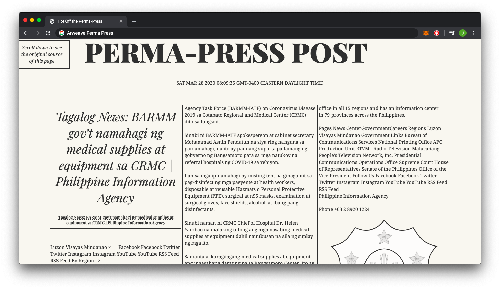
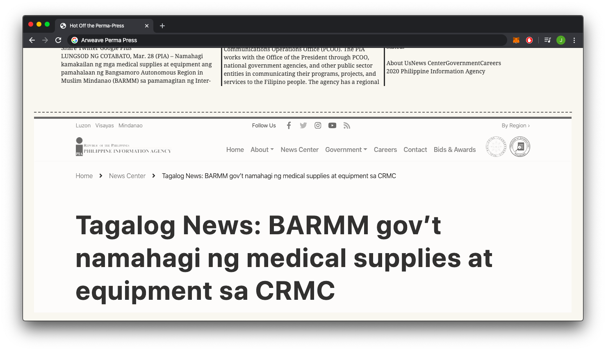
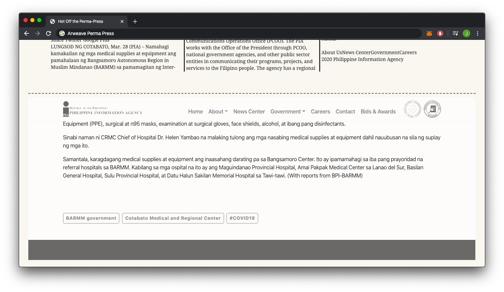

# opensource.arweaveBounty.PermaPress
## PERMA-PRESS POST

### PERMA-PRESS POST Overview

PERMA-PRESS POST is a web app that has a bit of fun with the content of what was saved. With so many pages relating to current events this app takes inspiration from the days of yester-year. When newsboys would stand on street corners, selling papers until they ran out. If you missed the day's edition, you were out of luck.

Make sure you check back often, as only the most recent saved webpage will be displayed!

PERMA-PRESS POST styles the body content of well formatted html pages into the frontpage of an old fashioned newspaper.

Once you have scrolled to the footer you will be able to view the archived webpage as if it was part of the newspaper

This web app was built for the [Open Web Hackathon](https://gitcoin.co/issue/ArweaveTeam/Bounties/1/2929) hosted by arweave. PERMA-PRESS POST is built with HTML, SCSS, and javascript.

This site is permanently hosted on the blockchain at [this](https://nshfwskp4mfs.arweave.net/ejiNxgo9bmq05YcOTbziSnwk7QDwyFZsKjE4SQA3Qlo) web address.
And you can also find it on [Arweave's App Directory](https://ftesrg4ur46h.arweave.net/nej78d0EJaSHwhxv0HAZkTGk0Dmc15sChUYfAC48QHI/index.html).

### Installation

This installation assumes you have [SCSS CLI](https://sass-lang.com/documentation/cli/dart-sass#many-to-many-mode) installed.

`$ git clone https://github.com/DownQuark-Work/opensource.arweaveBounty.PermaPress.git`

`$ cd opensource.arweaveBounty.PermaPress/src`

`$ sass --style=compressed --error-css --stop-on-error --trace --watch --update -c assets/styles/scss:assets/styles/css`

> open index.html in the browser of your choice.

That's it! 

### Deployment onto arweave

This part requires:
- [npm](https://docs.npmjs.com)
  - If you do not have it, you can download it [here](https://docs.npmjs.com/downloading-and-installing-node-js-and-npm)
- [arweave-deploy](https://github.com/ArweaveTeam/arweave-deploy)
  - If you do not have it, run `$ npm install -g arweave-deploy`

From the project folder, run: 
`$ arweave deploy src/index.html --package`

After these steps, the project should be deployed to the permaweb!
